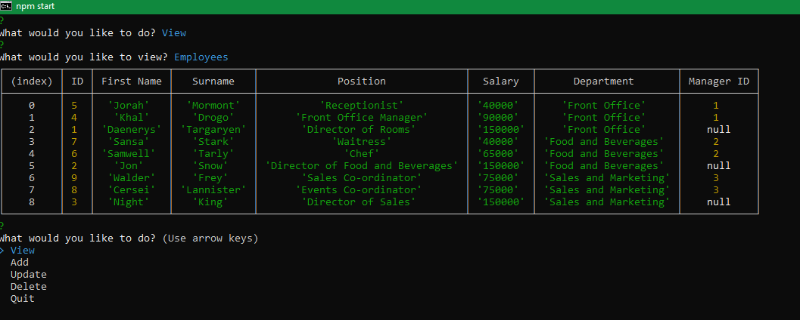

# Easy Employee Manager 
  
  
  
[Here is a link to the walk-through video](https://drive.google.com/file/d/163XM55quH7FaLif6Z2ofs5xMnRIOTGlE/view)

[Here is a link to the gitHub repo](https://github.com/brett-treweek/Easy-Employee-Manager)  


## Description
This Application is a Content Management System, designed to manage a companies employees.

It allows a user to add, view and update;   
- Employees
- Departments
- Roles

It also has functionality enabling users to;
- Update Employee Managers
- View Employees by manager
- View the total utilized budget of a department

This application utilises a seed file to create a database on mySQL and populate three tables with data.
The three tables are;
- Departments
- Employees
- Roles


---
## Table of Contents

- [Installation](#installation)
- [Usage](#usage)
- [License](#license)
- [Contributing](#contributing)
- [Tests](#tests)
- [Technologies](#technologies)
- [Questions](#questions)

---
## Installation  
  
Please follow these steps to install the project and any dependancies locally.

```bash
install node.js
clone the repo from gitHub
npm install
 
```

---
## Usage

 
[Here is a link to a walk-through video](https://note-creator-express.herokuapp.com/)

Run the app locally with the following command.   

```bash
npm start
```


---
## License

This project is licensed under 

---
## Contributing

Contributing to this project is not currently available.

---
## Tests

Please use these commands to perform tests.

```js

There are no tests at present.

```

---

## Technologies

- Javascript
- Node.js
- MySQL
- Inquirer

---

## Questions

For any questions and support please contact Brett Treweek  
- Email: bretttrew@gmail.com  
- Github: [brett-treweek](https://github.com/brett-treweek)